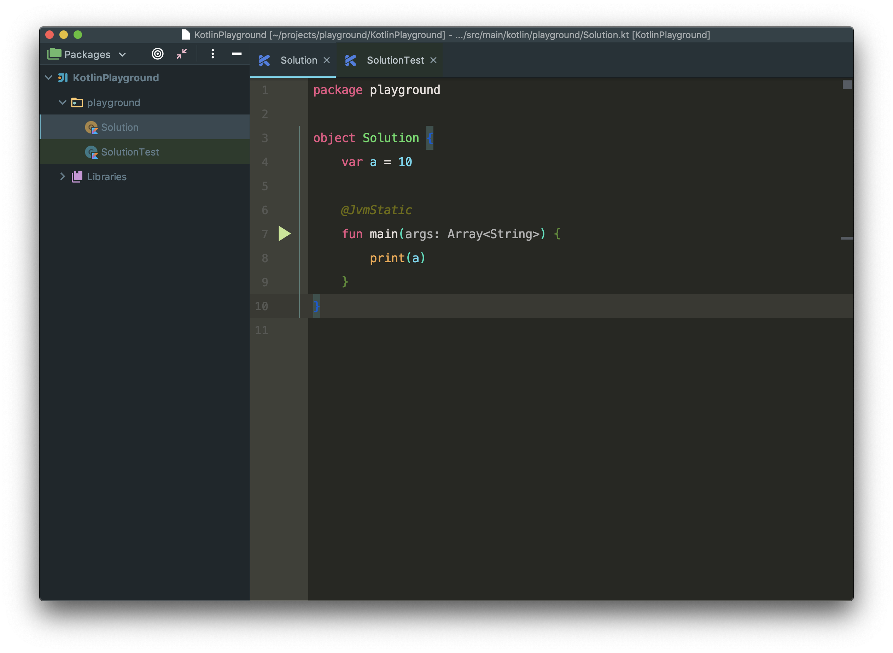
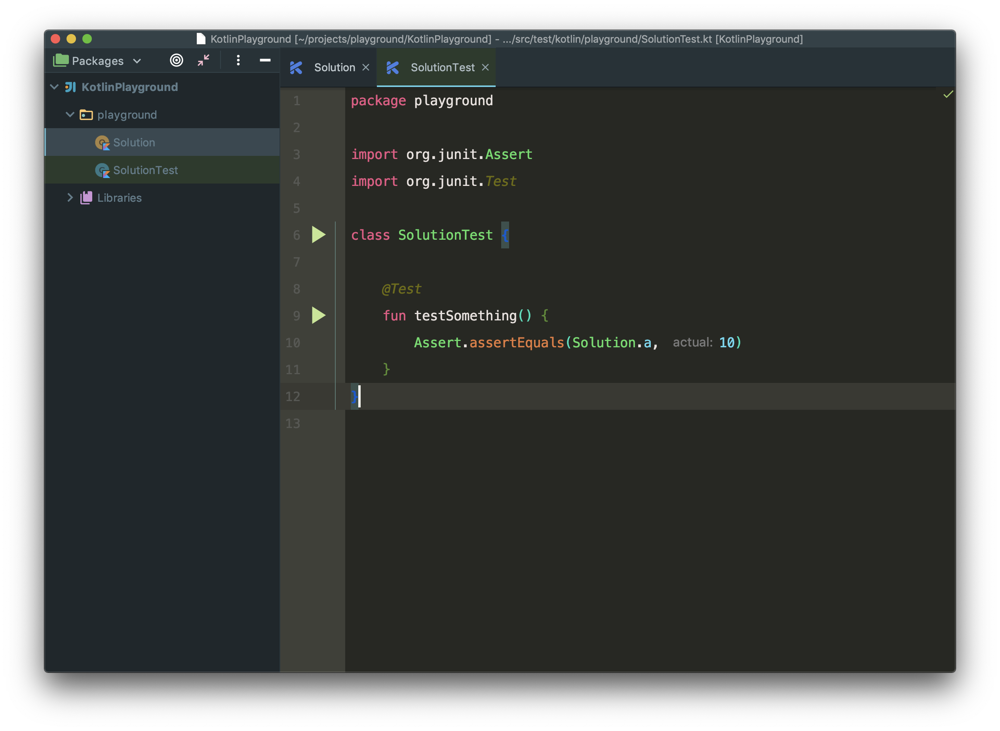
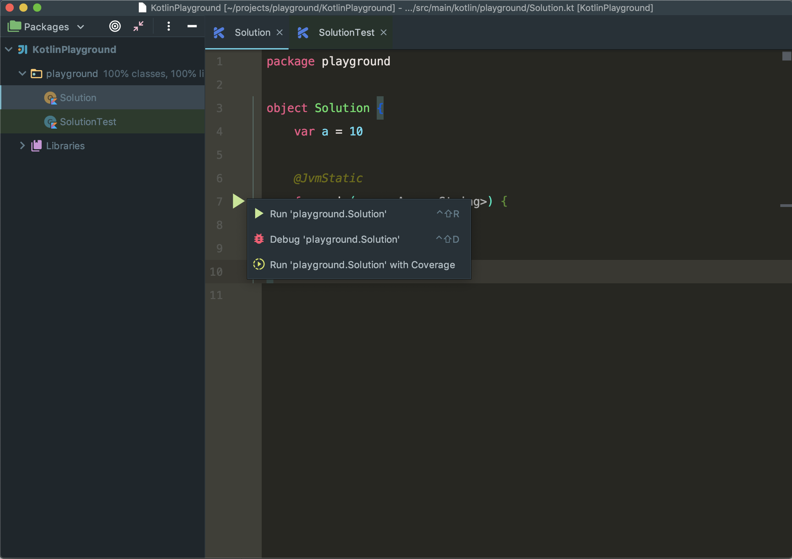
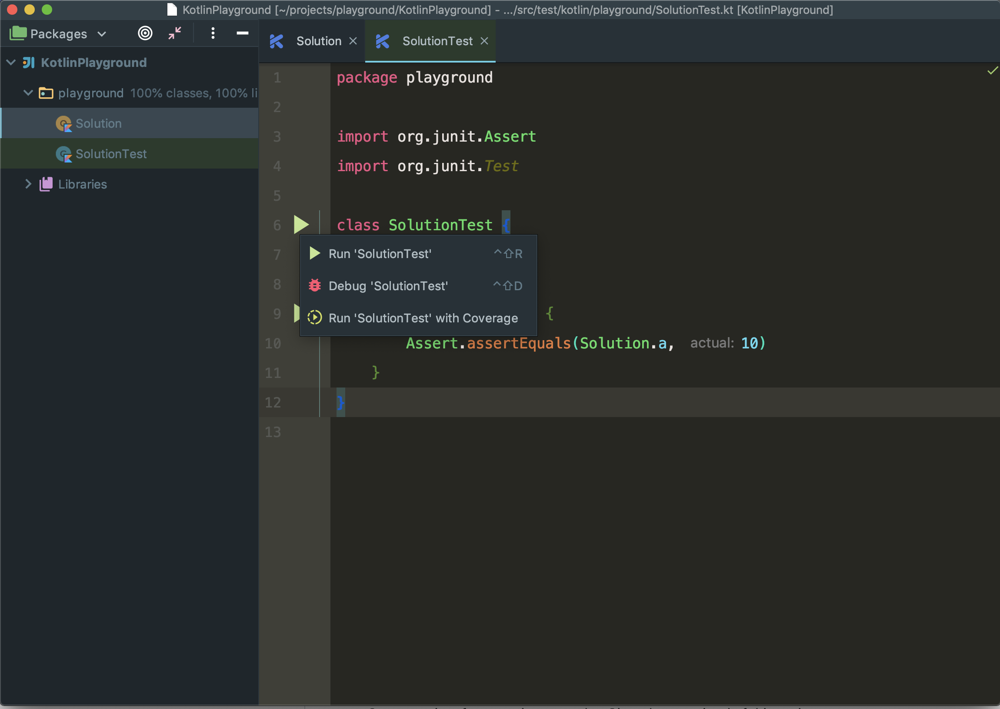
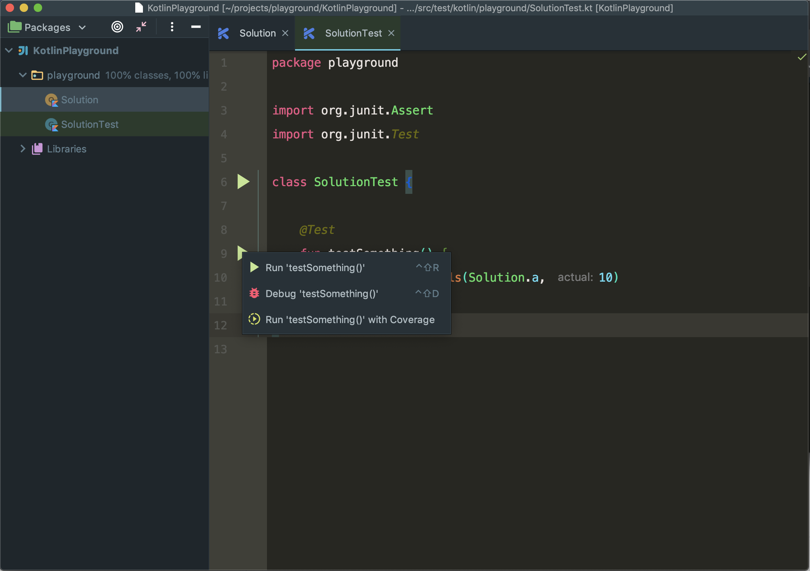

# Kotlin Playground

Pure kotlin (or java) project in Android Studio without the Android SDK.

- Supports for Junit tests.
- Easily add any core java dependencies via gradle.
- Runs flawlessly in Android Studio.
- Get all the features of IntelliJ Idea Platform and the Kotlin plugin.

## Setup:
- Open Android Studio.
- Start a project from version control → Git and paste git url of this project.
- **Important:** Run Gradle sync after opening the project.

## Screenshots:

### Classes:

### Test Suits:

### Run or Debug a main method of a class:

### Run or Debug a test suite:

### Run or Debug individual tests:

